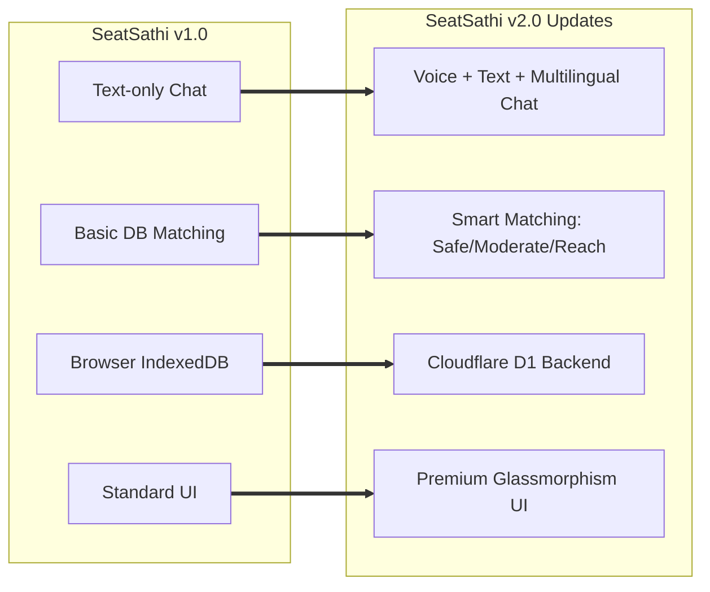
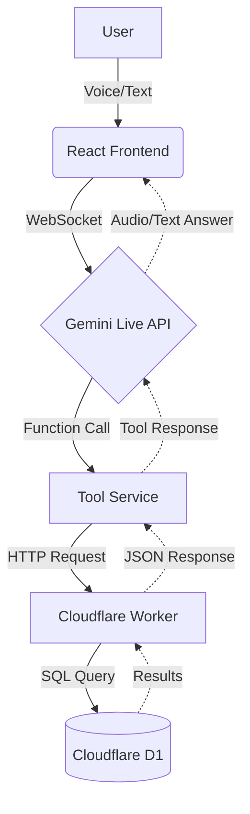
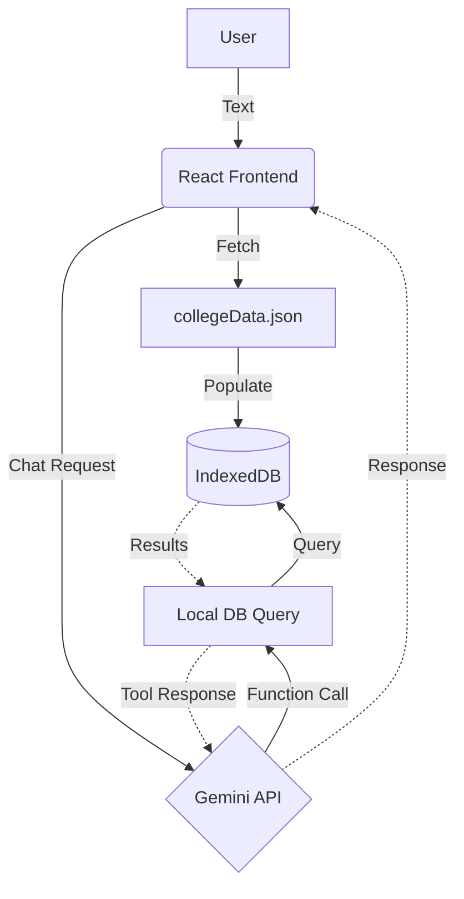

<div align="center">
  
  # SeatSathi - AI-Powered KCET Admission Counselor
  
  [](https://react.dev/)
  [](https://www.typescriptlang.org/)
  [](https://vitejs.dev/)
  [](https://ai.google.dev/)
  
  **Navigate your KCET engineering admissions with confidence using AI-powered guidance.**
  
  [Live Demo](#) | [Features](#features) | [Getting Started](#getting-started) | [Tech Stack](#tech-stack)
</div>


## About

**SeatSathi** is an AI-powered admission counselor specifically designed for **KCET (Karnataka Common Entrance Test)** aspirants. It helps students navigate the complex college admission process by providing instant cutoff analysis, college predictions, and personalized recommendations based on their rank, category, and preferences.

### Problem We Solve

Every year, thousands of Karnataka students struggle with:
- Understanding complex cutoff data across multiple rounds
- Matching their rank with appropriate colleges and branches
- Navigating through thousands of rows in official PDF documents
- Getting timely guidance during the stressful counselling period

**SeatSathi simplifies this by bringing AI-powered conversational guidance to students.**

---

## Features

### v2.0 (New Updates)

#### v1 to v2 Feature Evolution


#### Architecture (Cloudflare D1 based)


#### Dual-Mode Interface (Voice + Text)
- Natural conversation with AI using voice input or text chat
- Seamlessly switch between speaking and typing during the same session
- Supports **English**, **Hinglish**, and **Kannada** for better accessibility
- Real-time audio visualization for engaging interactions
- Powered by **Google Gemini 2.0 Flash Live API**

#### Smart College Matching (Upgraded)
- Intelligent filtering based on:
  - **Rank** (e.g., 5000, 12000)
  - **Category** (GM, 1G, 2AG, 2BG, 3AG, 3BG, SCG, STG, etc.)
  - **Course Preference** (CS, EC, Mechanical, Civil, AI/ML, Data Science, etc.)
  - **Location** (Bangalore, Mysore, or Anywhere)
- Probability-based recommendations (**Safe / Moderate / Reach**) based on a ±1000 rank tolerance logic
- Displays official KCET college codes (e.g. `[E001]`) directly in the UI

#### Modern UI/UX
- Premium **Glassmorphism** design utilizing ReactBits components (AuroraBackground, ShinyText, StarBorder)
- Clean, responsive design with **dark and light theme toggle**
- Visual college recommendation cards with KCET codes and chance tags
- Real-time transcription display and interactive chat box
- Mobile-friendly responsive layout

---

### v1.0 (Core Features)

#### Architecture (Browser DB / IndexedDB based)


#### Real KCET Data
- Verified cutoff data from **2024 & 2025** counselling rounds
- Comprehensive database covering **250+ colleges** across Karnataka
- Multi-round data (R1, R2, R3) for accurate predictions
- Supports KCET and COMEDK PDF analysis

#### PDF Analysis & Export
- Upload official KCET/COMEDK cutoff PDFs
- AI parses thousands of rows automatically
- Extract specific college/branch cutoffs from documents
- **Export college recommendations to PDF** for offline reference

#### User Authentication
- **Firebase Authentication** with Email/Password and Google Sign-In
- Secure user accounts for personalized experience
- Cloud sync capabilities via Firestore

---

## Getting Started

### Prerequisites

- **Node.js** (v18 or higher recommended)
- **Gemini API Key** from [Google AI Studio](https://aistudio.google.com/)

### Installation

1. **Clone the repository**
   ```bash
   git clone https://github.com/Shreervu/SeatSathi-.git
   cd seatsathi
   ```

2. **Install dependencies**
   ```bash
   npm install
   ```

3. **Configure environment variables**
   
   Create a `.env.local` file in the root directory:
   ```env
   GEMINI_API_KEY=your_gemini_api_key_here
   ```

4. **Run the development server**
   ```bash
   npm run dev
   ```

5. **Open your browser**
   
   Navigate to `http://localhost:5173` to start using SeatSathi!

### Build for Production

```bash
npm run build
npm run preview
```

---

## Tech Stack

| Technology | Purpose |
|------------|---------|
| **React 18** | Frontend UI framework |
| **TypeScript** | Type-safe development |
| **Vite** | Fast build tool & dev server |
| **Google Gemini Live API** | Conversational AI & voice/text streaming |
| **Cloudflare Workers** | Secure WebSocket proxy & connection management |
| **Cloudflare D1** | Rate limiting (max 50 sessions/hour per IP) to prevent abuse |
| **Firebase** | Authentication (Email/Google) & Firestore |
| **IndexedDB (Dexie.js)** | Local database for extremely fast offline cutoff data lookups |
| **PDF.js** | PDF parsing and text extraction |
| **jsPDF** | PDF export for recommendations |
| **Tailwind CSS** | Utility-first styling & glassmorphism effects |
| **ReactBits** | Advanced animated UI components |

---

## Project Structure

```
seatsathi/
├── App.tsx                 # Main application component
├── index.tsx               # Application entry point
├── types.ts                # TypeScript type definitions
├── components/
│   ├── common/             # Reusable UI components (Modals, Dropdowns)
│   ├── college/            # College recommendation cards
│   ├── landing/            # Landing page components & ReactBits
│   ├── agent/              # Voice visualizer and chat input components
├── services/
│   ├── audioUtils.ts       # Audio processing utilities
│   ├── toolService.ts      # AI tool implementations
│   ├── firebase.ts         # Firebase auth & Firestore
│   ├── database.ts         # IndexedDB schema (Dexie.js)
│   ├── dbPopulate.ts       # Database population scripts
│   └── pdfExport.ts        # PDF export functionality
├── gemini-proxy/
│   ├── src/index.ts        # Cloudflare worker WebSocket proxy with D1 rate limiting
│   └── wrangler.toml       # Cloudflare worker configuration
├── KCETcutoffdata/
│   ├── collegeData.ts      # Main data aggregator
│   └── colleges[1-116].ts  # Individual college data files
└── ...config files
```

---

## How It Works

1. **User Input**: Student provides their KCET rank, category, and course preferences via voice or text
2. **AI Processing**: Gemini AI processes the query and determines the appropriate action
3. **Tool Execution**: Backend tools (`find_matching_colleges`, `get_specific_college_cutoff`) query the cutoff database
4. **Smart Matching**: Algorithm matches student criteria against historical cutoff data
5. **Response Generation**: The agent generates personalized recommendations with probability scores
6. **Visual Display**: Results are displayed as interactive college cards

---

## Data Coverage

- **Years**: 2024, 2025 KCET counselling data
- **Rounds**: R1, R2, R3 cutoffs
- **Categories**: GM, 1G, 2AG, 2BG, 3AG, 3BG, SCG, STG, GMH, GMR, and more
- **Colleges**: 250+ engineering colleges across Karnataka
- **Branches**: CS, EC, ME, CV, IS, AI/ML, Data Science, Cyber Security, and various specializations
- **Languages**: English, Hinglish, and Kannada support

---

## Contributing

Contributions are welcome! Please feel free to submit a Pull Request.

1. Fork the repository
2. Create your feature branch (`git checkout -b feature/AmazingFeature`)
3. Commit your changes (`git commit -m 'Add some AmazingFeature'`)
4. Push to the branch (`git push origin feature/AmazingFeature`)
5. Open a Pull Request

---

## Disclaimer

SeatSathi AI is currently under development. Responses are generated by AI and may vary. **Please verify important details from official KCET sources before making admission decisions.**

---

<div align="center">
  <p>
    <strong>SeatSathi</strong> - Your AI Companion for KCET Counselling
  </p>
</div>
